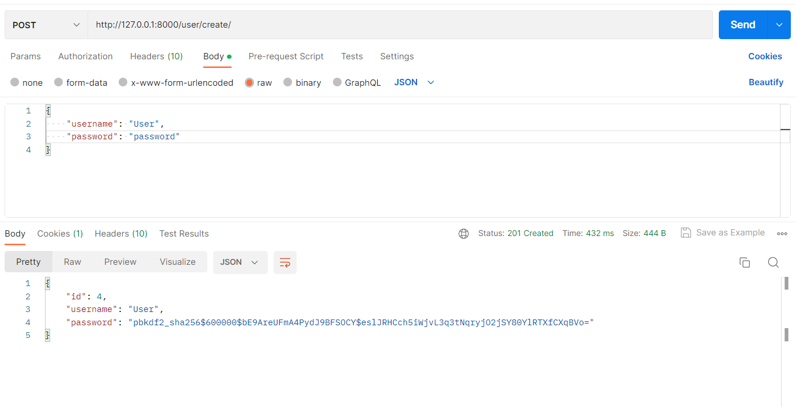
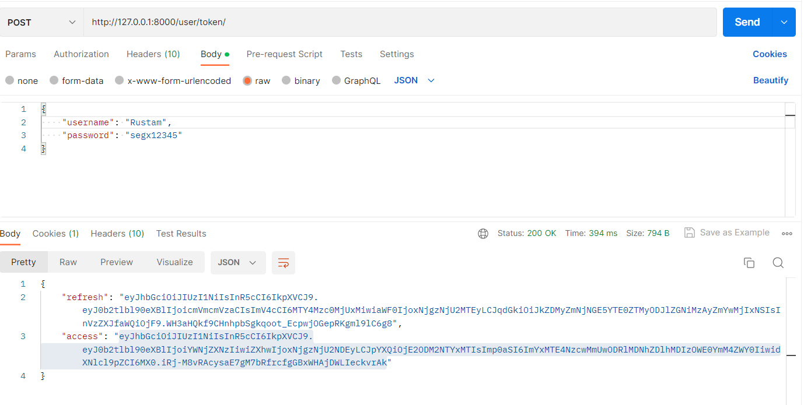
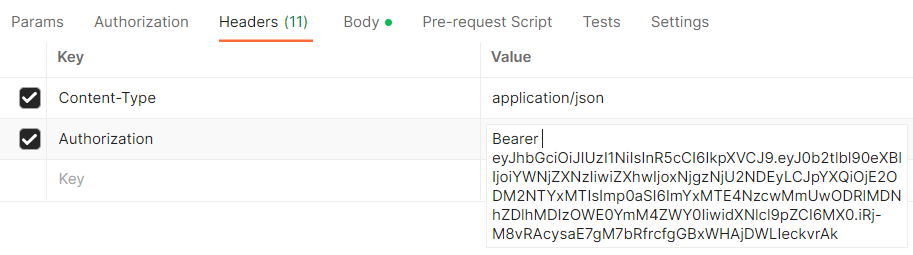
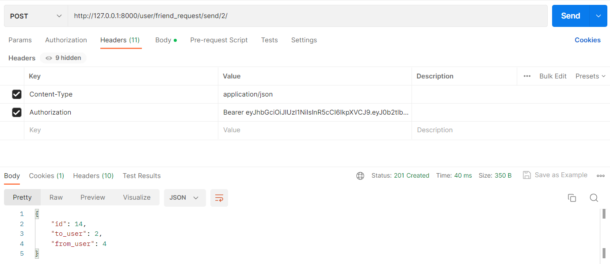
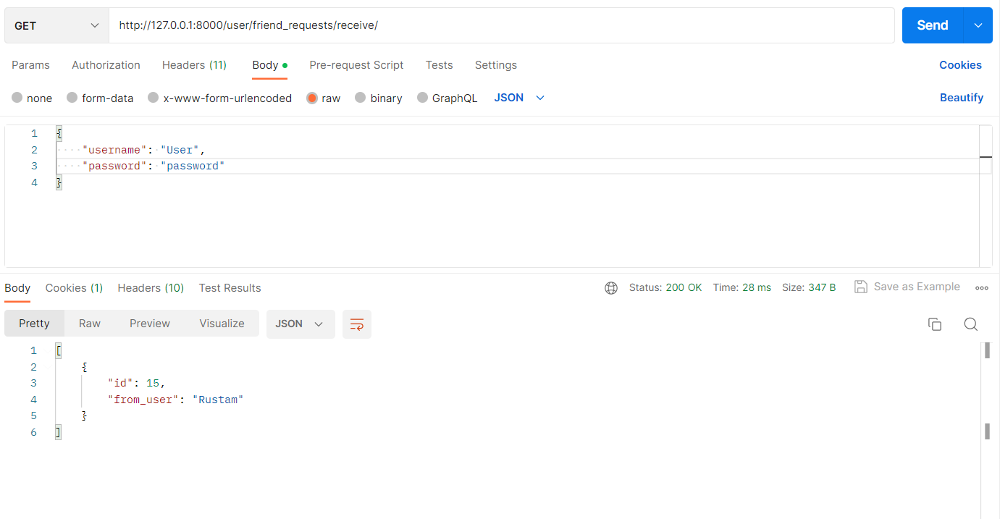
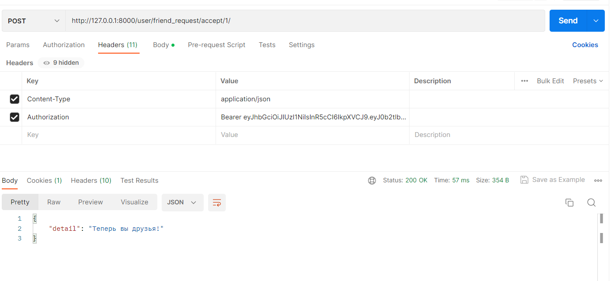
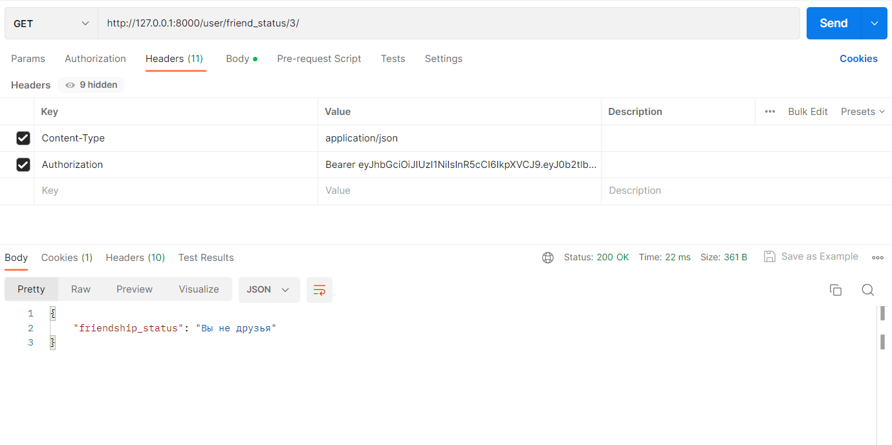
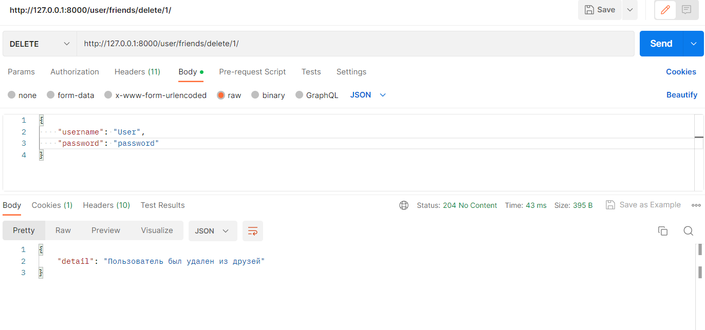

# Документация для приложения "Service_friends"
Приложение "Service_friends" представляет собой API функционал для управления друзьями в социальной сети. Пользователи 
могут 
отправлять друг другу запросы на добавление в друзья, принимать или отклонять эти запросы. Также сервис позволяет 
просматривать список друзей пользователя, исходящие и входящие заявки, а также удалять пользователей из списка друзей.  
Для удобства была использована база данных sqlite3. В некоторых запросах показана только часть функционала.
## Запуск сервиса
Сервис можно запустить с помощью Docker.  
Для этого необходимо:
1. Клонировать репозиторий с кодом.
2. Открыть терминал и перейдите в директорию проекта.
3. Запустите Docker Compose командой docker-compose up --build.
Теперь сервис должен быть доступен на порту, указанном в файле docker-compose.yml.  
  

## Регистрация пользователя
Регистрация пользователей осуществляется через JWT токен.  
## API функционал предоставляет следующие эндпоинты:  
- /api/docs/ - Документация API на Swagger  
- POST /user/create/ - создание нового пользователя. Принимает имя пользователя и пароль.  
##### Пример:  
>{  
&nbsp;&nbsp;"username": "new_user",  
&nbsp;&nbsp;"password": "password123"  
}

- POST /user/token/ - получение JWT-токена. Принимает имя пользователя и пароль.  
##### Пример:  
>{  
&nbsp;&nbsp;"username": "new_user",  
&nbsp;&nbsp;"password": "password123"  
}

> Этот токен в дальнейшем необходимо указывать при обработке каждого запроса
> 
- POST /user/token/refresh/ - обновление JWT-токена. Принимает refresh токен.    
##### Пример:  
>{  
&nbsp;&nbsp;&nbsp;&nbsp;"refresh": "your_refresh_token"  
}
- POST user/friend_request/send/user_id/ - отправка заявки в друзья другому пользователю. Ответом на запрос является 
  id заявки, а также информация от кого поступила заявка в друзья и кому.

##### Пример:  
>
- GET user/friend_requests/send/ - просмотр исходящих заявок в друзья. Где id - это номер заявки.    
##### Пример:  
>
- GET user/friend_requests/receive/ - просмотр входящих заявок в друзья. Где id - это номер заявки. 
##### Пример:  
>
- POST /friend_request/accept/user_id/ - принятие заявки в друзья от другого пользователя.  
>
- POST /friend_request/reject/user_id/ - отклонение заявки в друзья от другого пользователя.  
>
- GET /friend_status/user_id/ - просмотр статуса дружбы с другим пользователем.  
>
- GET /friends/ - просмотр списка друзей.  
>
- DELETE /friends/delete/user_id/ - удаление пользователя из списка друзей.
>